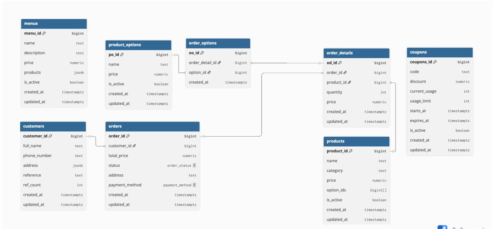
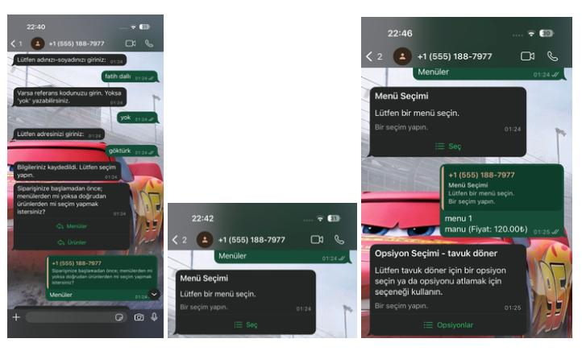
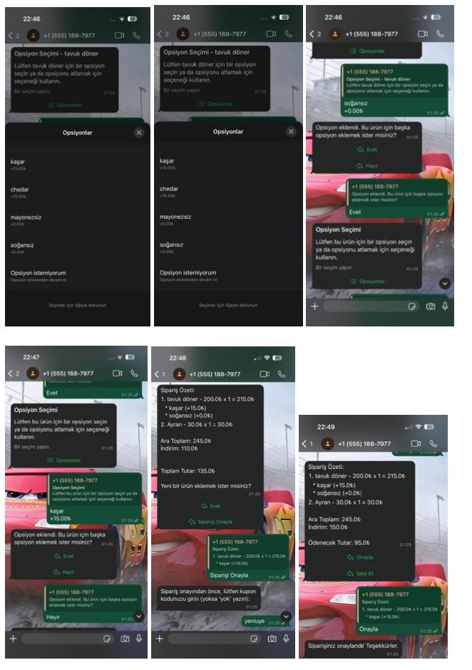
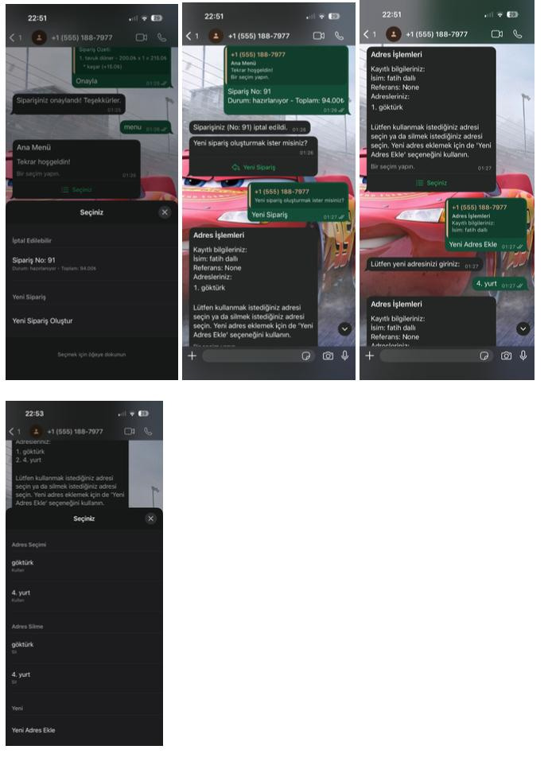
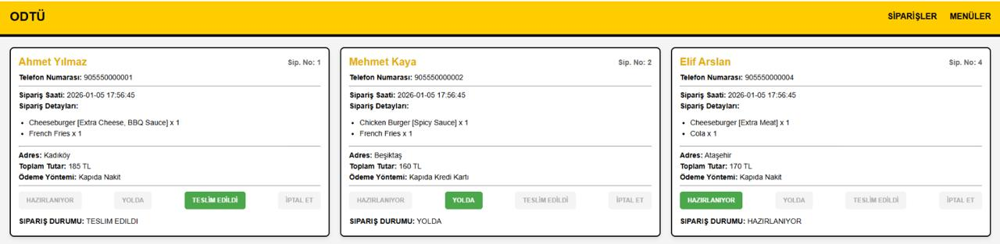
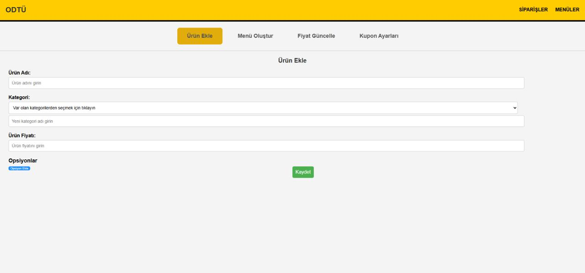
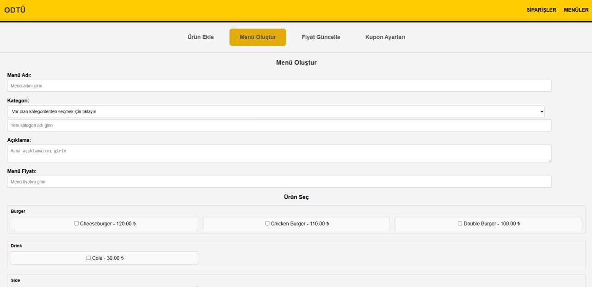
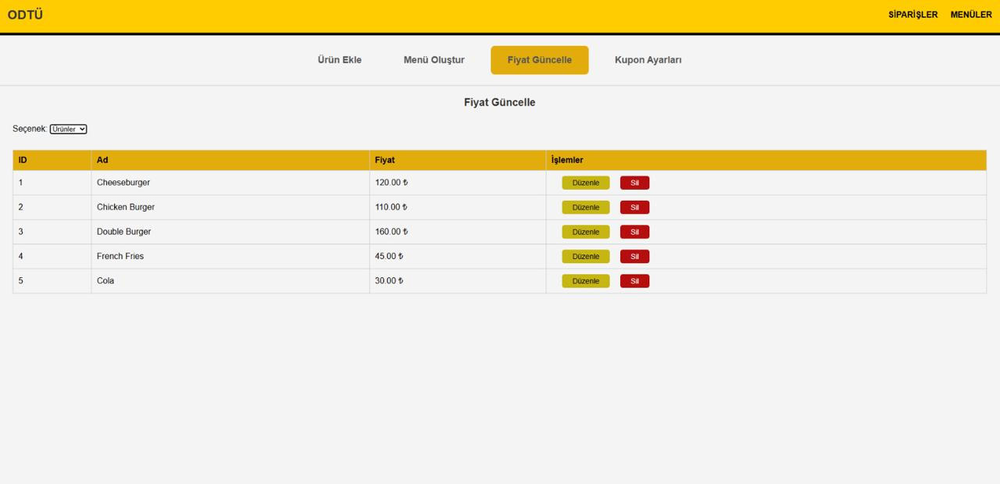
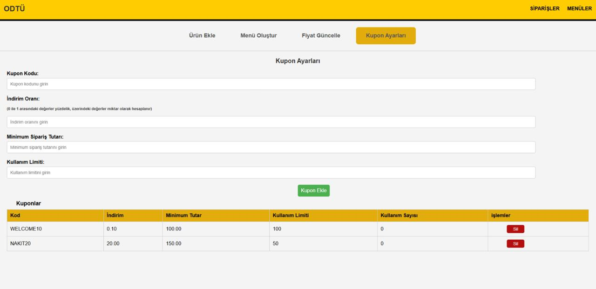

# 🥙 WhatsApp Order Automation & Real-Time KDS

  -blue) 

> **Role:** Lead Software Architect & Full-Stack Developer.

## 🚀 Project Summary
This project is a fully automated **Order Management System (OMS)** that eliminates manual order taking for high volume restaurants. It integrates the **Meta WhatsApp Cloud API** with a real time web dashboard (KDS), allowing customers to order food via chat while the kitchen staff receives instant audio visual alerts.

The system replaces manual phone taking/messaging with a structured, database driven workflow, reducing order errors significantly and increasing operational efficiency.

## 🏗️ System Architecture & Workflow

The application operates on a micro service logic backed by a robust PostgreSQL database:

1.  **Client Interface (WhatsApp Webhook):**
    * Customers interact with a Python based bot (`api.py`) acting as a state machine.
    * It handles complex flows: **Menu Selection -> Product Customization -> Cart Management -> Coupon Validation -> Order Confirmation**.
    * Utilizes WhatsApp's *Interactive Messages* (Reply Buttons & List Messages) for a native app experience.

2.  **Kitchen Display System (KDS):**
    * A responsive web dashboard (`app.py`) running on kitchen tablets.
    * **Real-Time Sync:** Uses **Flask-SocketIO** (WebSockets) to push new orders instantly. When an order arrives, the screen updates immediately and plays a notification sound ("Ding").
    * **Order Lifecycle:** Staff can update status (Preparing -> Delivered) which updates the database in real time.

3.  **Database Layer (PostgreSQL):**
    * Designed with strict **3NF (Third Normal Form)** normalization standards.
    * Acting as the single source of truth for products, orders, and user data.

## 🧩 Database Architecture (ER Diagram)
The database was architected to handle high volume transactional data while maintaining referential integrity. The schema follows strict normalization rules to prevent data redundancy and anomalies.

  

### Schema Highlights
* **`orders` & `order_details`:** Separated structure to handle multi-item baskets and historical data tracking efficiently.
* **`product_options`:** A bridge table allowing N:M relationships for customizations (e.g., "No Onion", "Extra Sauce").
* **`coupons`:** Features concurrency checks (`current_usage` vs `max_limit`) to prevent coupon abuse dynamically.

## 💻 Technical Highlights

### 1. State Machine Logic (Session Management)
Since WhatsApp API is stateless, I implemented a custom session handler in Python using the database. The system tracks the user's `phone_number` to determine their current context (e.g., `SELECTING_MENU`, `ENTERING_COUPON`), ensuring a smooth conversational flow.

### 2. Real Time Bidirectional Communication
Instead of using standard HTTP polling (which delays orders and strains the server), I utilized **WebSockets (Socket.IO)**.
* **Result:** 0-latency communication between the WhatsApp backend and the Kitchen Frontend.

### 3. Dynamic Menu & Coupon Engine
The admin panel (`menu.html`) allows for instant business logic changes without code deployment:
* **Dynamic Pricing:** Price updates reflect immediately on the bot.
* **Smart Logic:** Implemented algorithms for complex business rules (e.g., "Code `ILK50` valid only for the first 50 unique users").

## 📸 Interface Gallery

### 📱 1. Customer Experience (WhatsApp Flow)
*Interactive ordering experience via WhatsApp Business API (List Messages & Buttons).*

  
  
  

### 👨‍🍳 2. Kitchen Display System (Live Dashboard)
*Incoming orders appear instantly with sound notification. Staff can update status real-time.*

  

### ⚙️ 3. Admin & Menu Management
*Dynamic control over prices, products, and coupons via Web Panel.*

  
  
  
   

## 🛠️ Tech Stack

| Component | Technology | Usage |
| :--- | :--- | :--- |
| **Backend Framework** | Python / Flask | Core API logic & Webhook handling |
| **Real-Time Engine** | Flask-SocketIO | Instant frontend updates (WebSockets) |
| **Database** | PostgreSQL | Relational data storage (Hosted on DigitalOcean) |
| **ORM & SQL** | SQLAlchemy & Psycopg2 | Hybrid approach for ORM convenience & Raw SQL speed |
| **API Integration** | WhatsApp Cloud API | Business messaging interface |
| **Frontend** | HTML5 / JS / CSS | Admin & Kitchen Dashboards |

---
*Architected and Developed by Fatih Dallı and Ahmet Metin*
